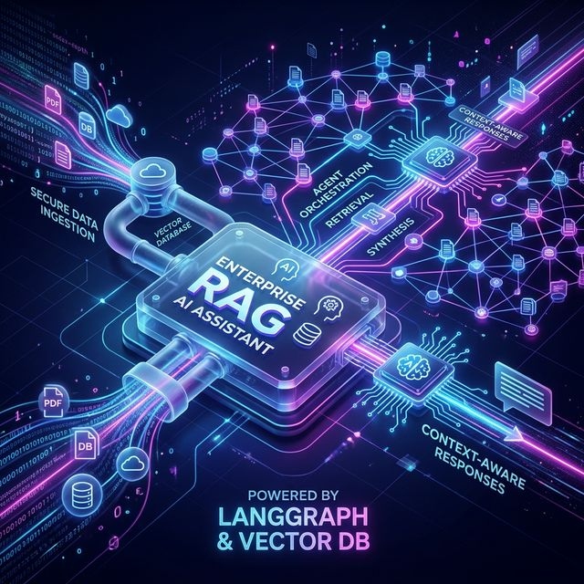

# 🧠 Enterprise RAG Assistant



A **GDPR-compliant Enterprise RAG (Retrieval-Augmented Generation) system** with agentic LangGraph workflows, multilingual support (DE/EN), cost tracking, and hybrid LLM infrastructure.

## Architecture

```
┌──────────────────────────────────────────────────────────────────┐
│                          Frontend (React + Tailwind)             │
│  ┌─────────┐ ┌──────────┐ ┌───────────┐ ┌──────────────────┐    │
│  │  Chat   │ │ Document │ │   Cost    │ │   Mode Toggle    │    │
│  │Interface│ │  Upload  │ │ Dashboard │ │  (Local/Cloud)   │    │
│  └────┬────┘ └────┬─────┘ └─────┬─────┘ └──────────────────┘    │
│       └───────────┴─────────────┴───────────────┐                │
│                                                 ▼                │
│                         Vercel (Frontend Hosting)                │
└─────────────────────────────┬────────────────────────────────────┘
                              │ REST API
┌─────────────────────────────▼────────────────────────────────────┐
│                    FastAPI Backend (Railway)                      │
│  ┌────────────────────────────────────────────────────────────┐   │
│  │  /query  │  /upload  │  /metrics  │  /health  │  /mode    │   │
│  └────┬─────┴─────┬─────┴──────┬─────┴─────┬─────┴─────┬────┘   │
│       │           │            │           │           │         │
│  ┌────▼────┐ ┌────▼─────┐ ┌───▼────┐ ┌────▼─────┐ ┌───▼────┐   │
│  │LangGraph│ │ Document │ │  Cost  │ │  Health  │ │  Mode  │   │
│  │  Agent  │ │Processor │ │Tracker │ │  Check   │ │ Switch │   │
│  │         │ │(PDF/TXT/ │ │(Token  │ │          │ │        │   │
│  │ Nodes:  │ │ Markdown)│ │ Count) │ │          │ │        │   │
│  │•Decision│ └──────────┘ └────────┘ └──────────┘ └────────┘   │
│  │•Tools   │                                                    │
│  │•Response│    ┌──────────────────────────────────────────┐     │
│  └────┬────┘    │           LLM Provider                   │     │
│       │         │  Local: Ollama ←→ Cloud: GPT-4o-mini     │     │
│       │         └──────────────────────────────────────────┘     │
│  ┌────▼──────────────────────────────────────┐                   │
│  │              RAG Pipeline                  │                   │
│  │  Hybrid Search (Vector + BM25)             │                   │
│  │  Source Citations • Multilingual (DE/EN)   │                   │
│  └────┬───────────────────────────────────────┘                   │
│       │                                                          │
│  ┌────▼────┐  ┌───────────┐  ┌──────────────────┐               │
│  │GDPR PII │  │  Slack    │  │  Teams           │               │
│  │Anonymize│  │  Bot      │  │  Bot             │               │
│  └─────────┘  └───────────┘  └──────────────────┘               │
└─────────────────────────────┬────────────────────────────────────┘
                              │
              ┌───────────────▼───────────────────┐
              │        Weaviate (Vector DB)         │
              │  Local: Docker  │  Cloud: Free Tier │
              └────────────────────────────────────┘
```

## Quick Start

### Prerequisites
- Python 3.12+, [uv](https://docs.astral.sh/uv/)
- Node.js 18+, npm
- Docker & Docker Compose
- (Optional) Ollama for local LLM

### 1. Clone & Configure

```bash
git clone <repo-url> && cd agentic-enterprise-rag-langgraph
cp .env.example .env
# Edit .env with your API keys
```

### 2. Start Infrastructure (Docker)

```bash
docker-compose up -d weaviate ollama
# Pull a local model (optional)
docker exec -it $(docker ps -qf "ancestor=ollama/ollama") ollama pull mistral
docker exec -it $(docker ps -qf "ancestor=ollama/ollama") ollama pull nomic-embed-text
```

### 3. Start Backend

```bash
cd backend
uv sync
uv run uvicorn app.main:app --reload --port 8000
```

### 4. Start Frontend

```bash
cd frontend
npm install
npm run dev
```

Open [http://localhost:5173](http://localhost:5173)

## System Modes

| Feature | 🔒 Local (GDPR) | ☁️ Cloud |
|---------|-----------------|----------|
| LLM | Ollama (Mistral) | GPT-4o-mini |
| Embeddings | nomic-embed-text | text-embedding-3-small |
| Vector DB | Docker Weaviate | Weaviate Cloud |
| Data leaves network | ❌ No | ✅ Yes |
| Cost | Free | Pay-per-token |

Switch modes via the UI toggle or `POST /mode` endpoint.

## API Endpoints

| Method | Path | Description |
|--------|------|-------------|
| POST | `/query` | Query (RAG or Agent mode) |
| POST | `/upload` | Upload & ingest document |
| GET | `/documents` | List indexed documents |
| GET | `/metrics` | Cost tracking data |
| POST | `/metrics/reset` | Reset metrics |
| GET | `/health` | System health check |
| GET/POST | `/mode` | Get/set system mode |
| POST | `/integrations/slack/events` | Slack bot webhook |
| POST | `/integrations/teams/webhook` | Teams bot webhook |

## Demo Queries

```
# English - Document search
"What is the company's data retention policy?"

# German - Automatic language detection
"Welche Sicherheitsrichtlinien gelten für Remote-Arbeit?"

# Agent with calculator tool
"What is sqrt(144) + 15 * 3?"

# Agent with external API
"What is the current weather in Berlin?"
```

## Testing

```bash
cd backend
uv sync --group dev
uv run pytest tests/ -v
```

## Evaluation

```bash
cd backend
uv run python -m evaluation.evaluate --base-url http://localhost:8000
```

## Deployment

### Backend → Railway
1. Connect GitHub repo to Railway
2. Set build directory to `backend/`
3. Add environment variables from `.env`
4. Railway auto-detects `railway.toml`

### Frontend → Vercel
1. Connect GitHub repo to Vercel
2. Set root directory to `frontend/`
3. Set `VITE_API_URL` to your Railway backend URL
4. Deploy

## Tech Stack

**Backend:** Python 3.12 · FastAPI · LangChain · LangGraph · Weaviate v4 · Ollama · OpenAI  
**Frontend:** React · TypeScript · Tailwind CSS · Recharts · Lucide Icons  
**Infrastructure:** Docker · Railway · Vercel

## License

MIT
